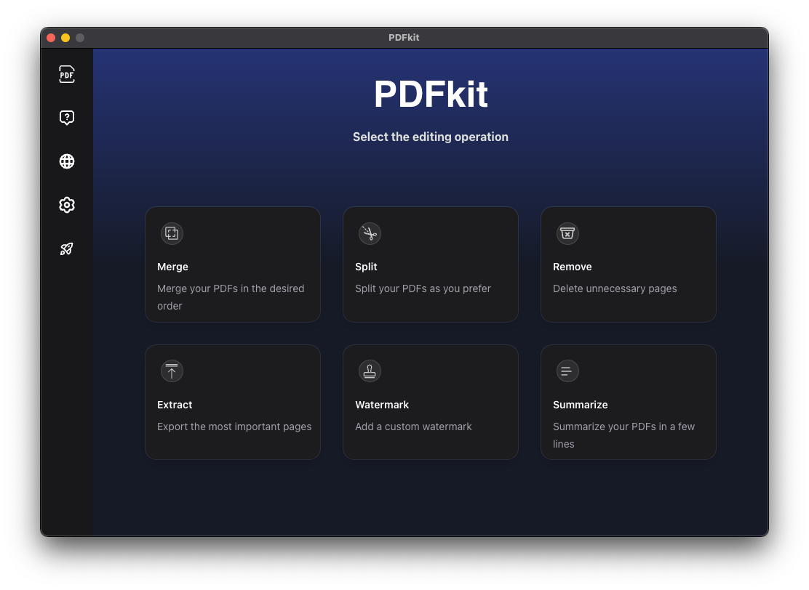
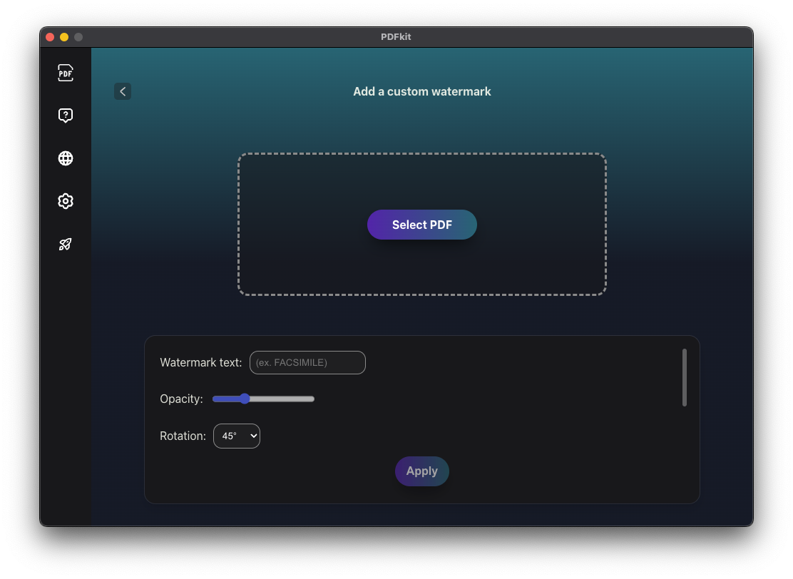
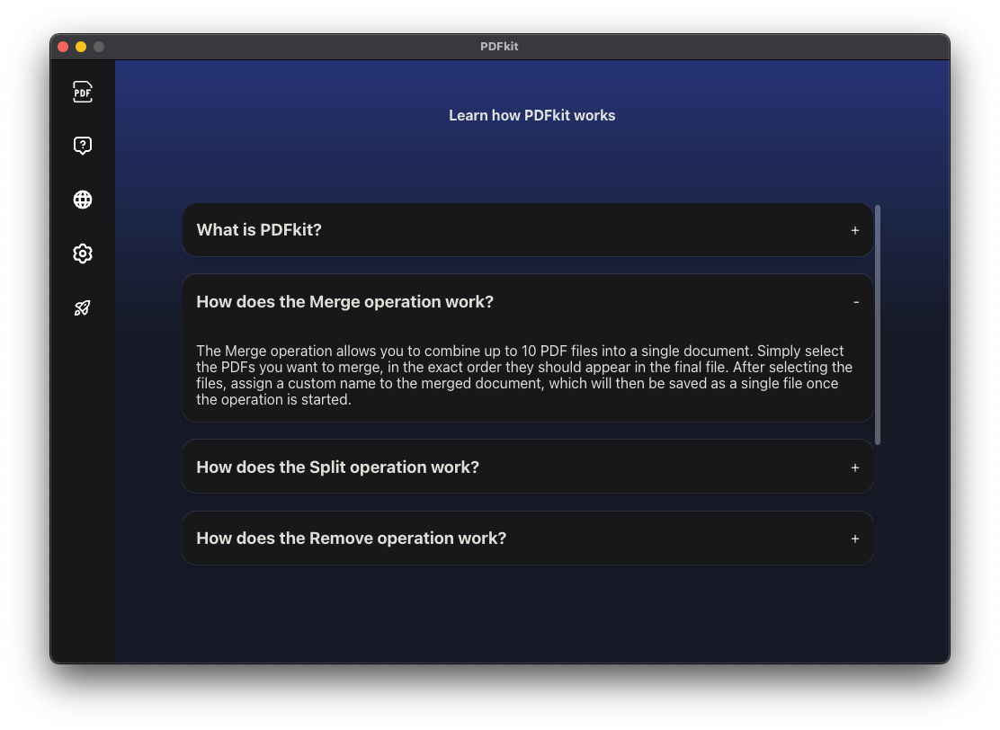

# 📄 PDFkit

**PDFkit** is a modern desktop application built with **Electron** and **React** that allows you to manage and modify PDF files quickly, securely, and mostly offline.

---

## ✨ Features

- 🔗 Merge multiple PDFs
- ✂️ Split PDFs by fixed or custom intervals
- 🧹 Remove specific pages from a PDF
- 📤 Extract selected pages to new PDFs
- 💧 Add customizable watermarks (text, opacity, position, rotation)
- 🧠 Summarize the content of a PDF using AI (requires internet connection)

---

## 📷 Screenshots






---

## 🛠 Technologies

- [Electron](https://www.electronjs.org/)
- [React](https://react.dev/)
- [pdf-lib](https://github.com/Hopding/pdf-lib)
- [pdfjs-dist](https://github.com/mozilla/pdf.js)
- [ApyHub API](https://apyhub.com/) – for PDF summarization

---

## 🚀 Installation

1. Go to the [Releases](https://github.com/your-username/PDFkit/releases) section
2. Download the installer for your OS:
   - macOS: `.dmg`
   - Windows: `.exe`
   - Linux: `.AppImage`
3. Launch the app and start modifying your PDFs!

---

## 🧪 Development Setup

```bash
# Clone the repository
git clone https://github.com/your-username/PDFkit.git
cd PDFkit

# Install dependencies
npm install

# Start in development mode
npm run dev
```

---

## 🏗 Building the App

```bash
# Build for macOS
npm run build:mac

# Build for Windows
npm run build:win

# Build for Linux
npm run build:linux
```

---

## ⚠️ Limitations

- The **AI-based summarization** feature requires an internet connection and is limited to a fixed number of free API calls
- Max 10 files can be merged in a single operation

---

## 📁 Export Directory

You can configure a custom export path in the **Settings** section of the app. If not specified, files are exported to your **Desktop** by default.

---

## 🧑‍💻 Author

**Gianluca Tondo**  
[GitHub Profile](https://github.com/gianlu15)

---

## 📜 License

This project is licensed under the [MIT License](./LICENSE).

---

## 🤝 Contributing

The main idea behind this project is to implement as many PDF-related features as possible, combining both offline operations—powered by internal libraries that allow maximum customization of common tasks (e.g., advanced merging like interleaved merge)—and online features that leverage external APIs to enable AI-powered operations, such as automatic summarization.
This hybrid approach aims to provide users with a powerful, flexible, and modern desktop tool for PDF editing.
Pull requests, ideas, and feedback are always welcome. Feel free to open an issue or fork the repository to contribute!
